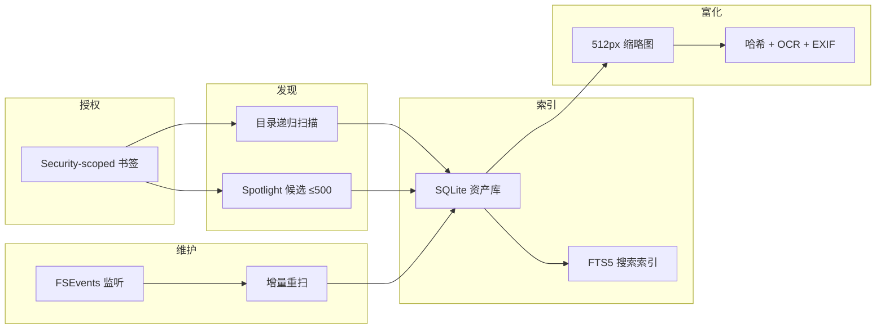
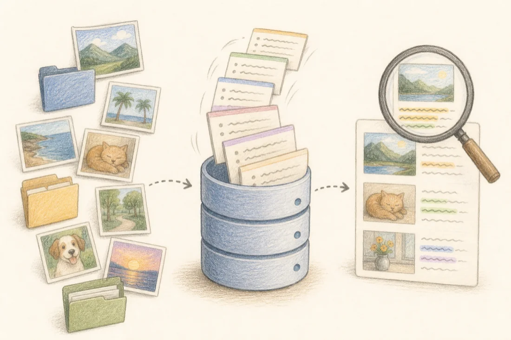
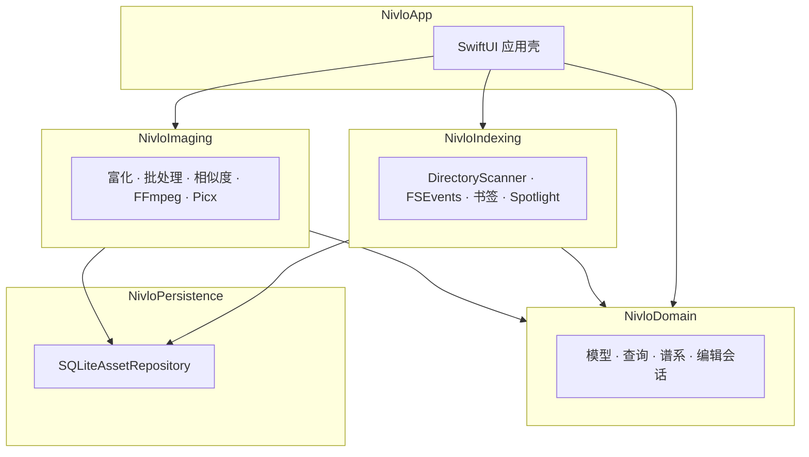

# Nivlo

[English](README.md) · [简体中文](README-CN.md)

**面向 macOS 的本地优先视觉资产工作台。**

在桌面、项目目录、下载文件夹和外置磁盘中，完成图片与视频的发现、索引、浏览、搜索、整理、编辑与版本追溯——无需导入专有图库，也不会上传原件。

[下载发布版](https://github.com/ingeniousfrog/Nivlo/releases) · [代码仓库](https://github.com/ingeniousfrog/Nivlo)

<p align="center">
  
</p>
<p align="center"><sub>授权你已在用的目录——原件不动，Nivlo 在上面叠加一层可搜索的浏览界面。</sub></p>

---

## 为什么需要 Nivlo

创作者和开发者的视觉素材本来就有自己的位置：Git 仓库、交付目录、临时下载区、外置硬盘。Nivlo 在现有目录结构之上叠加一层可搜索的索引，而不是要求你把文件搬进另一套系统。

你显式授权关心的文件夹，Nivlo 在本地建立 SQLite 索引、生成衍生缩略图与元数据、监听文件系统变更并记录处理历史——原件始终保留在原有路径。

Nivlo **不是** macOS「照片」的替代品，而是面向混合项目素材的**文件型工作台**：截图、参考图、导出稿、客户交付物、视频片段，都需要继续被路径直接寻址。

| | Nivlo | macOS「照片」 |
|---|-------|---------------|
| **存储** | 原位索引授权文件夹 | 统一管理的「照片图库」 |
| **工作流** | 搜索、批量导出、重命名、谱系追溯 | 个人图库、相簿、iCloud 同步 |
| **搜索** | 文件名、路径、OCR、元数据、颜色、重复与相似 | 人物、地点、回忆、智能相簿 |
| **编辑** | 文件导出、标注、蒙版、视频裁剪转码 | 图库内非破坏性编辑、实况照片 |
| **云端** | 纯本地，无账号与凭据 | iCloud 照片与 Apple 生态 |

---

## 一览

| | |
|---|---|
| **平台** | macOS 14+、Swift 6、SwiftUI |
| **代码规模** | 5 个 Swift Package 模块 · 70 个源文件 · 144 项自动化测试 |
| **索引引擎** | SQLite（WAL 模式）+ FTS5 全文检索 |
| **富化管线** | SHA-256、64 位 dHash、Vision OCR、EXIF/TIFF、主色分桶 |
| **文件监听** | FSEvents，事件合并 + 350 ms 防抖 |
| **图像管线** | Core Image 几何/调色、Picx（WebP/AVIF）、ImageIO 批量导出 |
| **视频管线** | AVFoundation 预览、FFmpeg/FFprobe 转码与裁剪 |
| **规模验证** | 合成基准测试覆盖 10 万条索引记录（见[性能](#性能)） |

---

## 工作原理



<p align="center">
  
</p>

**授权。** 通过 macOS security-scoped 书签授予库根目录访问权；启动时自动恢复，外置卷不可用时会隔离直至重新连接。

**发现。** 递归扫描授权目录中的图片与视频，跳过隐藏文件和包内容。完整索引建立前，最多可借助 500 条 Spotlight 元数据候选快速呈现资产。

**标识。** 以卷标识 + 文件资源 ID 作为资产主键，文件移动后可在重扫时 reconcile，避免重复记录。

**富化。** 有界并发管线计算 SHA-256 精确哈希、64 位差分哈希（相似度）、512 px 缩略图、Apple Vision OCR 文本、EXIF/TIFF 拍摄元数据与量化主色，全部写入 SQLite；原件不被修改。

**增量维护。** `LibraryRootFileEventMonitor` 通过 FSEvents 监听，将突发事件合并为文件夹级任务，350 ms 防抖后尽可能只重扫受影响的子树。

**仅衍生数据。** 缩略图、索引库、引导安装的工具与导出产物均存放在 Application Support；删除该目录只清除衍生数据，不影响源文件。

---

## 功能

### 素材库

<p align="center">
  
  &nbsp;&nbsp;
  
</p>

- 瀑布流网格浏览，缩略图渐进加载
- 图片/视频全屏预览；Inspector 展示文件信息、尺寸、RGB 直方图、EXIF、主色、关键词与可复制路径
- Lineage 面板追溯处理历史与衍生关系
- 基于 SQLite FTS5 搜索文件名、路径与 OCR 文本
- 智能视图（截图、最近下载、大文件）与多维筛选（时间、文件夹、格式、尺寸、颜色、来源、关键词）
- 本地隐藏资产，不删除原件
- 中英文界面；浅色 / 深色 / 跟随系统

### 整理

- SHA-256 完全重复归组
- dHash 汉明距离连通分量聚类的感知相似图
- 原位重命名（校验、扩展名保护、冲突预防、谱系记录）
- 拖拽文件 URL、复制路径或 Markdown 图片引用、在 Finder 中显示

### 批量与导出

- 多图导出到指定目录（库界面当前导出 JPEG；引擎支持 PNG、JPEG、WebP、AVIF，可设质量、缩放与文件名模板）
- 从源文件到每次衍生的完整处理历史

### 编辑 *(beta)*

<p align="center">
  
</p>

**图像** — 几何（裁剪、旋转、翻转）、全局与局部调整（曝光、色阶、曲线、HSL、蒙版）、标注、撤销/重做、前后对比、编辑会话持久化、Picx 优化 WebP/AVIF/JPEG/PNG 导出。

**视频** — 带缩略图与波形的时间轴，裁剪、画面裁切、缩放、旋转、帧率调整，FFmpeg 导出 MP4/MOV/WebM，硬件编解码检测、音量渐变、纯音频提取。

---

## 架构



| 模块 | 职责 |
|------|------|
| `NivloApp` | SwiftUI 可执行文件、库界面、编辑器、Inspector / Lineage |
| `NivloDomain` | 资产模型、查询、重命名规则、编辑会话、瀑布流布局 |
| `NivloIndexing` | 扫描、Spotlight、FSEvents、书签生命周期、索引校验 |
| `NivloImaging` | 富化、批处理、相似度分析、FFmpeg / Picx |
| `NivloPersistence` | 资产、富化数据与处理历史的 SQLite 仓储 |

并发模型：Swift 6 `actor` 隔离的仓储与富化管线；UI 通过 `async`/`await` 边界通信。

---

## 性能

合成基准工具 `NivloBenchmark` 以事务方式灌入 SQLite 夹具，测量启动、瀑布流布局、有界富化调度（8 路并发）与完整目录重扫耗时。

```bash
swift run NivloBenchmark
```

基线采集于 **2026 年 6 月 23 日**（维护者本机），供本地回归参考，不代表所有硬件环境下的绝对性能。

| 资产数 | 启动 | 瀑布流布局 | 富化（8×） | 全量重扫 |
|-------:|-----:|----------:|----------:|--------:|
| 10,000 | 12.15 ms | 1.88 ms | 44.83 ms | 431.40 ms |
| 50,000 | 63.89 ms | 11.96 ms | 232.24 ms | 2,085.12 ms |
| 100,000 | 117.02 ms | 21.45 ms | 469.97 ms | 4,203.56 ms |

---

## 隐私与存储

<p align="center">
  
</p>

| 原则 | 实现 |
|------|------|
| 不迁移图库 | 索引引用原位文件 |
| 无云同步与账号 | 产品表面完全本地运行 |
| 不默认扫描系统 | 仅索引用户授权文件夹 |
| 无远程凭据 | FFmpeg、Picx、Vision 均在设备端执行 |
| 可安全重置 | 删除 Application Support 只清除衍生数据 |

| 安装方式 | Application Support 路径 |
|----------|--------------------------|
| DMG / 发布版 `.app` | `~/Library/Application Support/dev.nivlo/` |
| `swift run Nivlo` | `~/Library/Application Support/Nivlo/` |

| 路径 | 内容 |
|------|------|
| `…/index.sqlite` | 资产记录、FTS 索引、富化数据、谱系 |
| `…/Thumbnails/` | 按内容哈希缓存的 512 px 预览 |
| `…/tools/` | 引导安装的 FFmpeg、FFprobe、Picx、Python venv |

首次启动时，`ToolBootstrapper` 会将外部工具安装到当前安装对应的 Application Support 目录。视频导出与 Picx 优化依赖此步骤。侧边栏 **Validate Index** 可检查索引健康、重试失败富化、修复书签访问。

---

## 快速开始

### 环境要求

- macOS 14 或更高版本
- Xcode 16 或更高版本（从源码构建时）
- Swift 6

### 下载

预编译版本发布于 [GitHub Releases](https://github.com/ingeniousfrog/Nivlo/releases)，文件名为 `Nivlo.dmg`。

1. 下载最新 `.dmg`，将 **Nivlo** 拖入 **应用程序**。
2. 若 macOS 拦截启动（当前为未签名早期版本），可右键 → **打开**，或执行：

```bash
xattr -cr /Applications/Nivlo.app
```

### 从源码运行

```bash
git clone https://github.com/ingeniousfrog/Nivlo.git
cd Nivlo
swift run Nivlo
```

### 首次使用

1. **授权文件夹** — 选择需要索引的目录。
2. **等待后台索引** — 扫描、缩略图生成与富化并发进行。
3. **浏览与处理** — 搜索、筛选、检查元数据、导出、重命名或打开编辑器。

---

## 开发

```bash
swift test                              # 144 项测试，覆盖 domain / indexing / imaging / persistence
swift run NivloBenchmark                # 10k / 50k / 100k 合成回归基准
swift run Nivlo --ui-smoke              # 图像编辑器冒烟（本地夹具）
swift run Nivlo --ui-smoke --ui-smoke-video
VERSION=0.1.0 Scripts/package-dmg.sh    # 构建 dist/Nivlo.app + dist/Nivlo.dmg
```

推送 `v*` 标签会触发 GitHub Actions 发布流程，并将 DMG 上传至 Releases。

---

## 许可证

Copyright © [Ingenious Frog](https://github.com/ingeniousfrog)

基于 [Apache License, Version 2.0](LICENSE) 发布。
