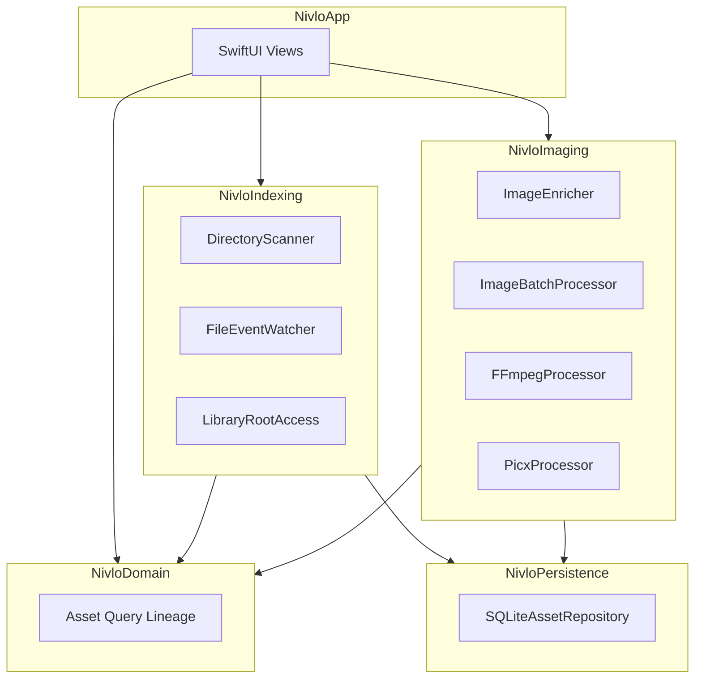

# Nivlo

[English](README.md) | [简体中文](README-CN.md)

**面向 macOS 的本地优先视觉资产工作台。**

Nivlo 帮助你在桌面、项目文件夹、下载目录和外置磁盘中发现、索引、浏览、搜索、整理、处理、编辑并追溯图片与视频——无需迁移原件，默认也不上传。

仓库地址：[github.com/ingeniousfrog/Nivlo](https://github.com/ingeniousfrog/Nivlo)

> 产品截图即将补充。

---

## 概述

Nivlo 面向视觉素材分散在多个位置的用户。你不需要把文件导入专有图库，只需显式授权关心的文件夹，Nivlo 会在现有目录结构之上建立丰富的本地索引，并持续监听变更。

Spotlight 可提供轻量级发现候选，但完整索引仅在用户授权文件夹后才会建立。所有衍生数据——缩略图、哈希、OCR 文本、导出文件——均存放在 Application Support 中，不会修改源文件。

---

## 核心特点

- **非破坏性设计** — 原件保留在原位；索引、缩略图与导出均为衍生数据。
- **显式授权** — 由你决定索引哪些文件夹，不会默认扫描整个系统。
- **稳定的文件标识** — 基于卷标识与文件资源 ID 追踪资产，重扫描时可 reconcile 已移动的文件。
- **丰富的本地元数据** — EXIF、Vision OCR、感知哈希、主色提取，以及基于 SQLite FTS 的全文检索。
- **可选云端 AI** — 自带 API Key，存储于 macOS Keychain；无捆绑模型额度，无默认云端分析。

---

## 功能

### 发现与索引

- 通过显式文件夹授权添加库根目录，并使用 security-scoped bookmarks 持久化访问权限。
- 跨启动恢复有效文件夹访问；对外置磁盘不可用的情况进行隔离。
- 递归扫描已授权目录中的图片与视频，跳过隐藏文件与包目录。
- 按来源分类资产：桌面、下载、文稿、外置卷、项目目录等。
- 在完整索引前，通过 Spotlight 元数据展示最多 500 条候选。
- 将文件与像素元数据持久化到启用 WAL 模式的 SQLite 数据库。
- 为资产生成缩略图、SHA-256 哈希、64 位感知哈希、EXIF/TIFF 元数据、Vision OCR 文本与主色桶。
- 通过 FSEvents 监听活跃库根，合并事件突发，并尽可能仅重扫描受影响的文件夹。
- 源文件变更时失效并重建衍生元数据；临时失去访问权限时保留已有记录。

### 浏览与搜索

- 在原生 SwiftUI 网格中浏览已索引资产，支持瀑布流布局。
- 通过 SQLite FTS 按文件名、路径、OCR 文本与关键词搜索。
- 智能视图：截图、最近下载、最近修改、大文件。
- 按时间、文件夹、格式、尺寸、文件大小、颜色、关键词、OCR 文本与来源筛选。
- 按日期、文件名、大小、尺寸与文件夹排序。
- 应用内支持英文与中文界面切换。

### 整理

- 按 SHA-256 内容哈希分组完全重复的文件。
- 通过连通分量聚类展示感知相似的图片。

### 批量处理与导出

- 将处理结果写入指定输出目录，不修改原件。
- 转换为 PNG、JPEG、WebP 或 AVIF（取决于当前 Mac 上 ImageIO 的支持情况）。
- 支持压缩质量、缩放与批量命名模板，并带防覆盖后缀。
- 复制文件路径或 Markdown 图片引用、在 Finder 中显示、从网格拖拽 file URL。
- 记录处理历史与从源文件到导出文件的衍生谱系。

### 图像编辑器 *(Phase 2 — 早期预览)*

- 在轻量编辑画布中打开已索引图片。
- 裁剪与旋转、调整参数、添加标注、绘制蒙版。
- 通过 Picx 导出优化后的衍生文件（WebP 等预设）。

### 视频编辑器 *(Phase 2 — 早期预览)*

- 通过 FFmpeg 对已索引视频进行裁剪、变换与导出。
- 使用 FFprobe 探测媒体信息；支持仅导出音频。

### AI 生成 *(Phase 2 — 早期预览，可选)*

- 可插拔的 `GenerationAdapter` 接口，覆盖文生图、图生图、局部重绘、扩图、抠图、超分辨率与风格变体等能力枚举。
- **当前已实现：** OpenAI Images（`text-to-image`、`image-to-image`），需用户提供 API Key。
- **规划中：** 本地模型适配器（接口已存在，尚未配置）。
- API Key 存储于 macOS Keychain，不会写入仓库或索引数据库。

---

## 隐私与本地优先

Nivlo 遵循以下原则：

- **无需迁移到专有图库** — 文件留在你原来的位置。
- **不强制云同步、账号或多用户协作。**
- **不默认扫描全系统目录** — 访问权限始终由用户显式授予。
- **不捆绑付费 AI 额度** — 云端生成需自行配置 API Key，完全可选。
- **可安全删除衍生数据** — 删除 `~/Library/Application Support/Nivlo/` 会清除索引、缩略图与工具缓存，不会影响任何原始图片或视频。

---

## 架构

Nivlo 以 Swift Package 组织，模块划分如下：



| 模块 | 职责 |
|------|------|
| `NivloApp` | SwiftUI 可执行入口与应用外壳 |
| `NivloDomain` | 领域模型、查询、编辑会话、生成接口 |
| `NivloIndexing` | 扫描、Spotlight 候选、FSEvents、书签授权 |
| `NivloImaging` | 富化、批处理、相似度分析、FFmpeg/Picx |
| `NivloPersistence` | 资产、富化数据与处理历史的 SQLite 仓储 |

---

## 快速开始

### 环境要求

- macOS 14 或更高版本
- Xcode 16 或更高版本
- Swift 6

### 从源码运行

在仓库根目录执行：

```bash
swift run Nivlo
```

### 首次使用

1. **授权文件夹** — 选择需要 Nivlo 索引的目录。
2. **等待索引** — Nivlo 在后台扫描已授权根目录、生成缩略图并富化元数据。
3. **浏览与处理** — 搜索、筛选、批量导出，或打开图像/视频编辑器。

首次启动时，Nivlo 还会在 Application Support 中自动准备外部工具（FFmpeg、FFprobe、Picx）。视频编辑与基于 Picx 的图像导出依赖此步骤成功完成。

---

## 开发

### 运行测试

```bash
swift test
```

测试使用 Swift Testing（`@Test`），覆盖 domain、indexing、imaging 与 persistence 模块。

### 外部工具

由 `ToolBootstrapper` 管理，安装路径：

```text
~/Library/Application Support/Nivlo/tools/
```

清单文件记录 FFmpeg、FFprobe、Picx 与 Python 虚拟环境。若视频导出或 Picx 优化失败，可在库侧边栏查看工具状态。

---

## 数据与存储

| 路径 | 内容 |
|------|------|
| `~/Library/Application Support/Nivlo/index.sqlite` | 主资产索引与 FTS 表 |
| `~/Library/Application Support/Nivlo/Thumbnails/` | 本地缩略图缓存 |
| `~/Library/Application Support/Nivlo/tools/` | 自动安装的 FFmpeg、FFprobe、Picx 及支持文件 |

以上路径均为衍生数据。删除它们不会移除或修改磁盘上的任何原始文件。

---

## 路线图

### Phase 1 — 已完成

本地视觉资产工作台：授权索引、丰富元数据、增量维护、浏览/搜索/筛选、重复检测、批量处理、导出历史与衍生谱系。

### Phase 2 — 进行中

- 轻量图像与视频编辑（当前构建中已提供早期预览）。
- 可插拔 AI 生成适配器（OpenAI 已实现；本地模型适配器规划中）。
- 更深的画布编辑、更多导出预设、更完整的版本谱系 UI。

### Phase 3 — 规划中

- 语义搜索与以图搜图。
- 自动聚类与项目资产关联。
- 可配置的本地自动化工作流。
- 可选的云服务/提供商集成，默认不上传。

---

## 许可证

Copyright © [Ingenious Frog](https://github.com/ingeniousfrog)

基于 [Apache License, Version 2.0](LICENSE) 许可发布。
