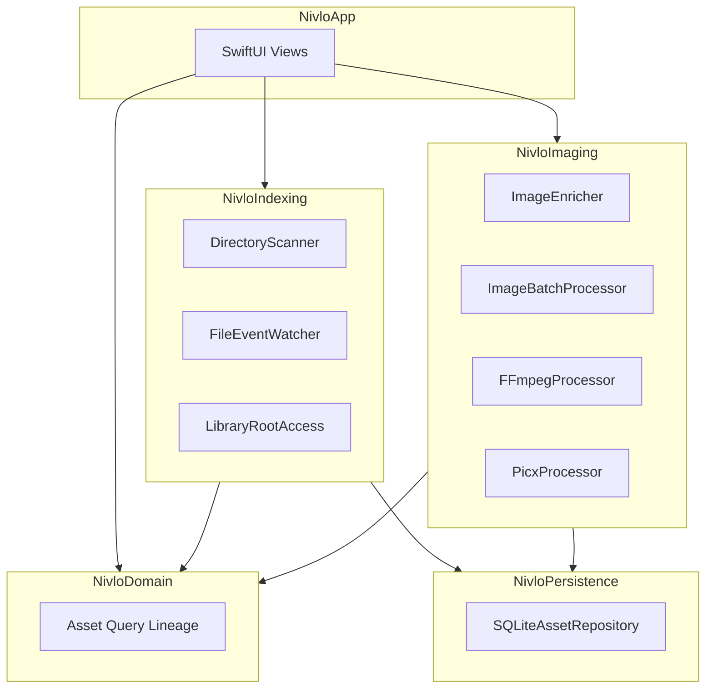

# Nivlo

[English](README.md) | [简体中文](README-CN.md)

**面向 macOS 的本地优先视觉资产工作台。**

Nivlo 帮助你在桌面、项目文件夹、下载目录和外置磁盘中发现、索引、浏览、搜索、整理、重命名、处理、编辑并追溯图片与视频——无需迁移原件，也不会上传原件。

仓库地址：[github.com/ingeniousfrog/Nivlo](https://github.com/ingeniousfrog/Nivlo)

> 项目状态最后一次按当前仓库核验：2026 年 6 月 23 日。

---

## 概述

Nivlo 面向视觉素材分散在多个位置的用户。你不需要把文件导入专有图库，只需显式授权关心的文件夹，Nivlo 会在现有目录结构之上建立丰富的本地索引，并持续监听变更。

Spotlight 可提供轻量级发现候选，但完整索引仅在用户授权文件夹后才会建立。所有衍生数据——缩略图、哈希、OCR 文本、导出文件——均存放在 Application Support 中，不会修改源文件。

### Nivlo 与 macOS「照片」的区别

Nivlo 并不打算替代「照片」面向个人图库与 iCloud 的完整体验。它更适合创作者和开发者：素材原本就散落在项目目录、下载文件夹、外置磁盘与其他自主管理的位置，需要在不迁移文件的前提下完成查找、处理与交付。

| 维度 | Nivlo | macOS「照片」 |
|------|-------|---------------|
| 存储方式 | 原位索引用户授权的文件夹，原件路径保持不变 | 通过「照片图库」导入或引用素材并统一管理 |
| 核心场景 | 项目素材、搜索、批处理、衍生导出与版本追溯 | 个人回忆、iPhone 拍摄、相簿、分享与跨设备同步 |
| 云端方式 | 纯本地产品表面；不需要账号、同步服务或外部凭据 | 深度集成 iCloud Photos 与 Apple 生态 |
| 搜索整理 | 文件名、路径、OCR、元数据、颜色、来源、完全重复与感知相似 | 人物与宠物、地点、日期、媒体类型、相簿、智能相簿、回忆与语义搜索 |
| 编辑方向 | 文件型编辑、导出预设、标注、蒙版、视频裁剪与本地交付流程 | 成熟的照片调整、实况照片/人像/电影效果与扩展 |
| 版本追溯 | 显式记录处理历史与衍生谱系 | 在「照片图库」内部保存非破坏性编辑 |

因此，Nivlo 最合适的定位是**本地视觉资产工作台**，而不是「照片」的复刻：保留用户对文件夹的所有权，让大型混合素材库可搜索，并把重命名、传统编辑和批量交付连接成一条可追溯流程。

---

## 核心特点

- **非破坏性设计** — 原件保留在原位；索引、缩略图与导出均为衍生数据。
- **显式授权** — 由你决定索引哪些文件夹，不会默认扫描整个系统。
- **稳定的文件标识** — 基于卷标识与文件资源 ID 追踪资产，重扫描时可 reconcile 已移动的文件。
- **丰富的本地元数据** — EXIF、Vision OCR、感知哈希、主色提取，以及基于 SQLite FTS 的全文检索。
- **无需外部凭据** — 应用不提供远程处理设置，不要求账号，也没有外部凭据流程。

---

## 功能

### 发现与索引

- 通过显式文件夹授权添加库根目录，并使用 security-scoped bookmarks 持久化访问权限。
- 跨启动恢复有效文件夹访问；对外置磁盘不可用的情况进行隔离。
- 递归扫描已授权目录中的图片与视频，跳过隐藏文件与包目录。
- 按来源分类资产：桌面、下载、文稿、外置卷、项目目录等。
- 在完整索引前，通过 Spotlight 元数据展示最多 500 条候选。
- 将文件与像素元数据持久化到启用 WAL 模式的 SQLite 数据库。
- 为资产生成缩略图、SHA-256 哈希、64 位感知哈希、EXIF/TIFF 元数据、Vision OCR 文本与主色桶。
- 通过 FSEvents 监听活跃库根，合并事件突发，并尽可能仅重扫描受影响的文件夹。
- 源文件变更时失效并重建衍生元数据；临时失去访问权限时保留已有记录。

### 浏览、预览与搜索

- 在原生 SwiftUI 网格中浏览已索引资产，支持瀑布流布局。
- 为图片与视频打开完整预览，支持编辑、重命名、导出、隐藏与在访达中显示。
- **信息（Inspector）** 面板：结构化元数据、图像/视频规格、RGB 直方图与溢出提示（图片）、富化后的 EXIF 拍摄信息、主色色块、关键词标签，以及可复制路径。
- **谱系（Lineage）** 面板：查看与当前素材关联的处理历史。
- 通过 SQLite FTS 按文件名、路径、OCR 文本与关键词搜索。
- 智能视图：截图、最近下载、最近修改、大文件。
- 按时间、文件夹、格式、尺寸、文件大小、颜色、关键词、OCR 文本与来源筛选。
- 按日期、文件名、大小、尺寸与文件夹排序。
- 从主图库隐藏素材而不删除原件；在 **隐藏文件** 中查看与恢复。
- 应用内支持英文与中文界面，设置中可选浅色 / 深色 / 跟随系统外观。

### 整理

- 按 SHA-256 内容哈希分组完全重复的文件。
- 通过连通分量聚类展示感知相似的图片。
- 从预览工具栏或卡片右键菜单原位重命名原始文件，含校验、冲突预防、仅编辑主文件名，并写入处理历史。
- 书签失效或外置磁盘重新连接时，可对文件夹执行 **重新授权**。

### 批量处理与导出

- 在图库中多选图片，导出到指定输出目录，不修改原件。
- 批处理引擎支持 PNG、JPEG、WebP、AVIF，以及质量、缩放与命名模板；当前图库 UI 将所选图片导出为 JPEG。
- 复制文件路径或 Markdown 图片引用、在 Finder 中显示、从网格拖拽 file URL。
- 记录处理历史与从源文件到导出文件的衍生谱系。

### 图像编辑器 *(Phase 2 — Beta)*

- 在原生编辑器中打开已索引图片，含几何、调整、标注、蒙版与导出工具。
- 裁剪、旋转、翻转、撤销/重做、前后对比、缩放/平移，以及可保存的编辑会话。
- **基础** 调整：曝光、对比度、饱和度、色温、色调、高光、阴影、清晰度、自然饱和度、锐化、降噪与暗角。
- **色阶**、**曲线** 与分色 **HSL** 控制，以及内置与用户保存的调整预设。
- 高级编辑在需要时通过显式渲染预览；通过 Picx 导出优化后的衍生文件。
- 添加可编辑文字、矩形与箭头标注；绘制蒙版笔触并进行局部调整。
- 将导出的编辑结果记录到素材谱系中。

### 视频编辑器 *(Phase 2 — Beta)*

- 带时间轴缩略图与波形的预览；截取、裁切、缩放、旋转并修改帧率。
- 通过 FFmpeg 导出 MP4、MOV 或 WebM 衍生文件；通过 FFprobe 探测媒体信息。
- 硬件编码检测、音量淡入淡出，以及可选的仅导出音频。

---

## 隐私与本地优先

Nivlo 遵循以下原则：

- **无需迁移到专有图库** — 文件留在你原来的位置。
- **不强制云同步、账号或多用户协作。**
- **不默认扫描全系统目录** — 访问权限始终由用户显式授予。
- **不需要外部处理凭据** — 没有远程处理设置，也没有凭据存储路径。
- **可安全删除衍生数据** — 删除对应安装实例的 Application Support 目录（正式版为 `dev.nivlo`，`swift run` 为 `Nivlo`）会清除索引、缩略图与工具缓存，不会影响任何原始图片或视频。

---

## 架构

Nivlo 以 Swift Package 组织，模块划分如下：



| 模块 | 职责 |
|------|------|
| `NivloApp` | SwiftUI 可执行入口与应用外壳 |
| `NivloDomain` | 领域模型、查询、编辑会话、重命名校验与谱系 |
| `NivloIndexing` | 扫描、Spotlight 候选、FSEvents、书签授权 |
| `NivloImaging` | 富化、批处理、相似度分析、FFmpeg/Picx |
| `NivloPersistence` | 资产、富化数据与处理历史的 SQLite 仓储 |

---

## 快速开始

### 环境要求

- macOS 14 或更高版本
- Xcode 16 或更高版本
- Swift 6

### 下载安装

macOS 预编译包发布在 [GitHub Releases](https://github.com/ingeniousfrog/Nivlo/releases)，文件名为 `Nivlo.dmg`。

1. 从 Releases 下载最新的 `.dmg`。
2. 打开后将 **Nivlo** 拖入 **Applications**。
3. 首次启动时，macOS 可能提示应用来自未识别开发者。可以任选其一：
   - 在应用程序文件夹中 **右键 Nivlo → 打开**，并在弹窗中确认一次。
   - 或在终端中清除下载隔离标记：

```bash
xattr -cr /Applications/Nivlo.app
```

当前 DMG 为未签名早期测试构建，尚未进行 Apple 代码签名与公证。如需开发调试或跟踪最新提交，请使用下方源码运行方式。

已安装的正式版与 `swift run Nivlo` 开发运行使用不同的 Application Support 目录：

| 安装方式 | Application Support 路径 |
|----------|-------------------------|
| DMG / `.app` 正式版 | `~/Library/Application Support/dev.nivlo/` |
| `swift run Nivlo` 开发运行 | `~/Library/Application Support/Nivlo/` |

如果安装正式版后仍看到开发时添加的文件夹，可能是旧版本共用同一路径所致。可删除旧目录，或在正式版中对文件夹执行「重新授权文件夹」。

### 从源码运行

在仓库根目录执行：

```bash
swift run Nivlo
```

### 首次使用

1. **授权文件夹** — 选择需要 Nivlo 索引的目录。
2. **等待索引** — Nivlo 在后台扫描已授权根目录、生成缩略图并富化元数据。
3. **浏览与处理** — 搜索、筛选、查看信息面板、批量导出、原位重命名，或打开图像/视频编辑器。

首次启动时，Nivlo 会在该安装实例的 Application Support 目录中自动准备外部工具（FFmpeg、FFprobe、Picx）。视频编辑与基于 Picx 的图像导出依赖此步骤成功完成。可在侧边栏使用 **校验索引** 查看索引健康状态、重试富化失败项并修复访问问题。

---

## 开发

### 运行测试

```bash
swift test
```

测试使用 Swift Testing（`@Test`），覆盖 domain、indexing、imaging 与 persistence 模块。

### 性能基准

在仓库根目录运行 1 万 / 5 万 / 10 万条合成素材基准测试：

```bash
swift run NivloBenchmark
```

测试项包括：

- 事务化夹具写入后的 SQLite 库启动耗时。
- 滚动场景使用的瀑布流布局计算。
- 有界并发的富化调度。
- 完整的合成目录重扫。

2026 年 6 月 23 日基线：

| 素材数 | 启动 | 布局 | 富化 | 重扫 |
|-------:|-----:|-----:|-----:|-----:|
| 10,000 | 12.15 ms | 1.88 ms | 44.83 ms | 431.40 ms |
| 50,000 | 63.89 ms | 11.96 ms | 232.24 ms | 2,085.12 ms |
| 100,000 | 117.02 ms | 21.45 ms | 469.97 ms | 4,203.56 ms |

以上数据仅作本机回归对比基线，不代表所有硬件上的绝对性能目标。

### UI 冒烟流程

用于真实编辑器 UI 冒烟测试：

```bash
swift run Nivlo --ui-smoke
swift run Nivlo --ui-smoke --ui-smoke-video
```

冒烟模式会创建本地 PNG 与 H.264 MOV 夹具，并打开图像或视频编辑器，不会触碰用户素材库。

### 本地打包 DMG

本地构建 release 版 `.app` 与 `.dmg`：

```bash
VERSION=0.1.0 Scripts/package-dmg.sh
```

产物输出到 `dist/Nivlo.app` 与 `dist/Nivlo.dmg`。DMG 带有拖放到「应用程序」的安装布局并内置应用图标。推送 `v*` 格式的 git tag 后，GitHub Actions 会执行相同打包流程并将 DMG 上传到 Releases。

### 外部工具

由 `ToolBootstrapper` 管理，安装在当前安装实例的 Application Support 目录下，例如：

```text
~/Library/Application Support/dev.nivlo/tools/
~/Library/Application Support/Nivlo/tools/
```

清单文件记录 FFmpeg、FFprobe、Picx 与 Python 虚拟环境。若视频导出或 Picx 优化失败，可在库侧边栏查看工具状态。

---

## 数据与存储

| 路径 | 内容 |
|------|------|
| `~/Library/Application Support/dev.nivlo/index.sqlite` | 正式版（DMG 安装）索引 |
| `~/Library/Application Support/Nivlo/index.sqlite` | 开发版（`swift run`）索引 |
| `~/Library/Application Support/*/Thumbnails/` | 对应安装实例的本地缩略图缓存 |
| `~/Library/Application Support/*/tools/` | 自动安装的 FFmpeg、FFprobe、Picx 及支持文件 |

以上路径均为衍生数据。删除它们不会移除或修改磁盘上的任何原始文件。

---

## 路线图

以下 Phase 按可交付的用户结果划分，而不是按是否已经出现接口或 UI 外壳划分。

### Phase 0 — 工程底座 *(已完成)*

原生 SwiftUI 应用外壳、模块化 Swift Package、SQLite 持久化、安全范围文件夹授权，以及 domain/indexing/imaging/persistence 自动化测试。

### Phase 1 — 本地素材库 *(核心已完成)*

本地视觉资产工作台：授权索引、丰富元数据、增量维护、浏览/搜索/筛选、重复检测、批量处理、导出历史与衍生谱系。

后续工作主要是产品加固：大型素材库性能、更清晰的索引/工具健康状态、恢复流程，以及真实使用场景验证。

### Phase 2 — 原生编辑工作台 *(Beta，进行中)*

当前已经具备：

- 图像几何、标注、蒙版、撤销/重做、前后对比、缩放/平移，以及可保存的编辑会话。
- 基础整图调整，以及色阶、曲线、HSL 分色、预设与高级编辑的渲染预览。
- 视频预览、时间轴、截取、变换、导出、音频提取，以及基于 FFprobe 的元数据读取。
- 素材预览中的信息（Inspector）与谱系（Lineage）面板。
- 处理历史与衍生谱系记录。

下一阶段编辑重点：

- 更完整的蒙版局部调整与图层工作流。
- 在编辑器内提供直方图驱动的调整控件，而不只是信息面板中的检视。
- 为已有的多格式批处理引擎补齐更完整的批量导出 UI。
- 更广的格式覆盖，以及大型编辑场景下的性能加固。

### Phase 3 — 本地整理工作台 *(下一阶段)*

当前已经具备：

- 单个原始文件的原位重命名，含校验、扩展名保护与谱系更新。

计划下一步：

- 批量重命名：预览、编号、命名模板、冲突检查与撤销。
- 保存搜索与智能集合，用于反复出现的项目素材流程。
- 更强的重复/相似图片处理：并排对比、保留/隐藏决策和按文件夹清理。
- 本地元数据编辑：标签、评分、备注与项目标记，存储在 Nivlo 索引中。
- 更可靠的文件操作：移动/复制到项目文件夹、显示全部衍生文件、修复丢失路径。

### Phase 4 — 本地自动化与交付 *(后续)*

- 可复用的本地工作流：缩放、转换、水印、重命名与导出预设。
- 监听文件夹规则，将新截图、下载内容和项目素材整理为可交付输出。
- 更完善的历史控制：可撤销操作、批处理快照和清晰的失败恢复。
- 在能保证本地运行的前提下，引入可选的设备端分析能力，源文件仍留在本机。
- 打包体验完善：签名/公证、更新流程与首次启动示例库。

---

## 许可证

Copyright © [Ingenious Frog](https://github.com/ingeniousfrog)

基于 [Apache License, Version 2.0](LICENSE) 许可发布。
