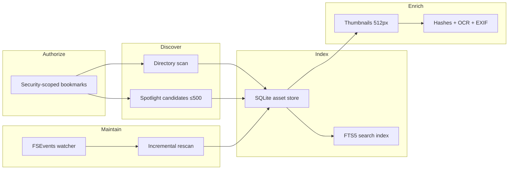
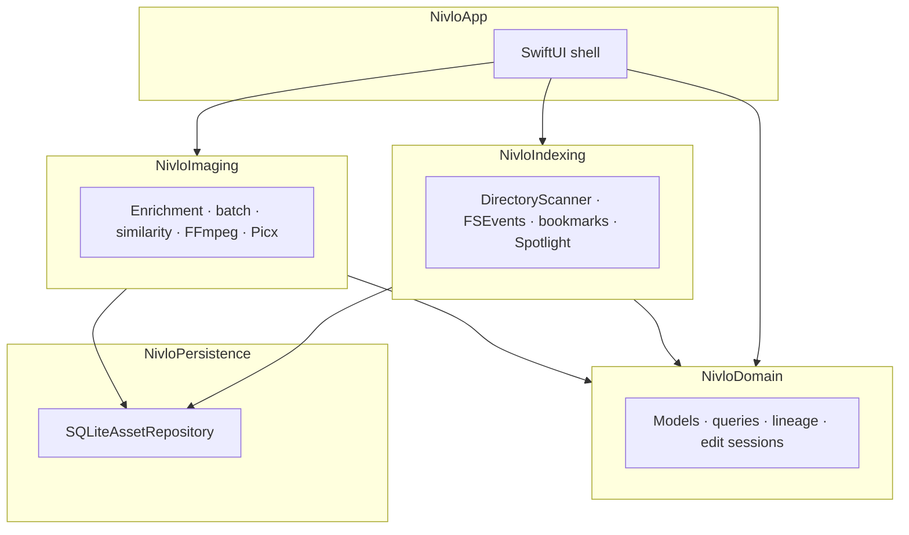

# Nivlo

[English](README.md) · [简体中文](README-CN.md)

**A local-first visual asset workbench for macOS.**

Index, browse, search, organize, edit, and trace images and videos across Desktop, project folders, Downloads, and external drives — without importing files into a proprietary library or uploading them anywhere.

[Releases](https://github.com/ingeniousfrog/Nivlo/releases) · [Repository](https://github.com/ingeniousfrog/Nivlo)

<p align="center">
  
</p>
<p align="center"><sub>Authorize the folders you already use — originals stay in place; Nivlo adds a searchable gallery on top.</sub></p>

---

## Why Nivlo

Creators and developers keep visual assets where they already belong: Git repos, delivery folders, scratch directories, and removable volumes. Nivlo adds a searchable layer on top of that layout instead of asking you to migrate everything into another system.

You explicitly authorize the folders that matter. Nivlo builds a local SQLite index, generates derivative thumbnails and metadata, watches for filesystem changes, and keeps processing history — while originals stay on disk at their existing paths.

Nivlo is **not** a replacement for Apple Photos. It is a **file-oriented workbench** for mixed project assets: screenshots, references, exports, client deliverables, and video clips that need to remain addressable by path.

| | Nivlo | Apple Photos |
|---|-------|--------------|
| **Storage** | In-place indexing of authorized folders | Managed Photos library |
| **Workflow** | Search, batch export, rename, lineage | Personal library, albums, iCloud sync |
| **Search** | Filename, path, OCR, metadata, color, duplicates, similarity | People, places, memories, Smart Albums |
| **Editing** | File exports, annotations, masks, video trim/transcode | Non-destructive library edits, Live Photos |
| **Cloud** | Local-only; no accounts or credentials | iCloud Photos and Apple ecosystem |

---

## At a Glance

| | |
|---|---|
| **Platform** | macOS 14+, Swift 6, SwiftUI |
| **Codebase** | 5 Swift Package modules · 70 source files · 144 automated tests |
| **Index engine** | SQLite (WAL) + FTS5 full-text search |
| **Enrichment** | SHA-256, 64-bit dHash, Vision OCR, EXIF/TIFF, dominant-color buckets |
| **File watching** | FSEvents with event coalescing and 350 ms debounce |
| **Image pipeline** | Core Image geometry/adjustments, Picx (WebP/AVIF), ImageIO batch export |
| **Video pipeline** | AVFoundation preview, FFmpeg/FFprobe transcode and trim |
| **Scale tested** | Synthetic benchmarks through 100k indexed assets (see [Performance](#performance)) |

---

## How It Works



<p align="center">
  
</p>

**Authorization.** Library roots are granted through macOS security-scoped bookmarks. Access is restored across launches; unavailable external volumes are isolated until reconnected.

**Discovery.** Authorized directories are scanned recursively for images and videos. Hidden files and packages are skipped. Up to 500 Spotlight metadata candidates can surface assets before a folder is fully indexed.

**Identity.** Each asset is keyed by volume identifier and file resource ID, so moved files can be reconciled on rescan without duplicating records.

**Enrichment.** A bounded-concurrency pipeline computes SHA-256 exact hashes, 64-bit difference hashes for similarity, 512 px thumbnails, Apple Vision OCR text, EXIF/TIFF capture metadata, and quantized dominant colors. Results are stored in SQLite; originals are never modified.

**Incremental maintenance.** `LibraryRootFileEventMonitor` listens via FSEvents, coalesces burst events into folder-level work items, debounces for 350 ms, and rescans only affected subtrees when possible.

**Derivatives only.** Thumbnails, the index database, bootstrapped tools, and export outputs live under Application Support. Deleting that folder clears derived data without touching source files.

---

## Capabilities

### Library

<p align="center">
  
  &nbsp;&nbsp;
  
</p>

- Masonry grid browsing with progressive thumbnail loading
- Full preview for images and videos; Inspector with file facts, dimensions, RGB histogram, EXIF, dominant colors, keywords, and copyable paths
- Lineage panel for processing history and derivative relationships
- Search across filename, path, and OCR text via SQLite FTS5
- Smart views (screenshots, recent downloads, large files) and multi-axis filters (time, folder, format, size, color, source, keywords)
- Hide assets locally without deleting originals
- English and Chinese UI; light / dark / system appearance

### Organization

- Exact-duplicate groups by SHA-256
- Perceptual-similarity clusters via connected-component analysis on dHash Hamming distance
- In-place rename with validation, extension safety, conflict prevention, and lineage records
- Drag file URLs, copy paths or Markdown image references, reveal in Finder

### Batch & Export

- Multi-image export to a chosen output directory (library UI currently exports JPEG; engine supports PNG, JPEG, WebP, AVIF with quality, resize, and filename templates)
- Processing history from source through every derivative

### Editing *(beta)*

<p align="center">
  
</p>

**Images** — geometry (crop, rotate, flip), global and local adjustments (exposure, levels, curves, HSL, masks), annotations, undo/redo, before/after comparison, saved edit sessions, Picx-optimized WebP/AVIF/JPEG/PNG export.

**Videos** — timeline with thumbnails and waveform, trim, crop, scale, rotate, frame-rate change, MP4/MOV/WebM export via FFmpeg, hardware codec detection, volume fades, audio-only extraction.

---

## Architecture



| Module | Responsibility |
|--------|----------------|
| `NivloApp` | SwiftUI executable, library UI, editors, Inspector / Lineage |
| `NivloDomain` | Asset models, queries, rename rules, edit sessions, masonry layout |
| `NivloIndexing` | Scanning, Spotlight, FSEvents, bookmark lifecycle, index validation |
| `NivloImaging` | Enrichment, batch processing, similarity analysis, FFmpeg / Picx |
| `NivloPersistence` | SQLite repositories for assets, enrichment, and processing history |

Concurrency model: Swift 6 `actor`-isolated repositories and enrichment pipelines; UI communicates through `async`/`await` boundaries.

---

## Performance

Synthetic benchmark harness (`NivloBenchmark`) seeds transactional SQLite fixtures and measures startup, masonry layout, bounded enrichment scheduling (8 concurrent tasks), and full directory rescan.

```bash
swift run NivloBenchmark
```

Baseline captured **June 23, 2026** on the maintainer machine — use as a local regression reference, not a universal hardware guarantee.

| Assets | Startup | Masonry layout | Enrichment (8×) | Full rescan |
|-------:|--------:|---------------:|------------------:|------------:|
| 10,000 | 12.15 ms | 1.88 ms | 44.83 ms | 431.40 ms |
| 50,000 | 63.89 ms | 11.96 ms | 232.24 ms | 2,085.12 ms |
| 100,000 | 117.02 ms | 21.45 ms | 469.97 ms | 4,203.56 ms |

---

## Privacy & Storage

<p align="center">
  
</p>

| Principle | Implementation |
|-----------|----------------|
| No library migration | Index references files in place |
| No cloud sync or accounts | Entire product surface is local |
| No default system scan | Only user-authorized folders are indexed |
| No remote credentials | FFmpeg, Picx, and Vision run on-device |
| Safe to reset | Deleting Application Support removes derived data only |

| Install | Application Support path |
|---------|--------------------------|
| DMG / release `.app` | `~/Library/Application Support/dev.nivlo/` |
| `swift run Nivlo` | `~/Library/Application Support/Nivlo/` |

| Path | Contents |
|------|----------|
| `…/index.sqlite` | Asset records, FTS index, enrichment, lineage |
| `…/Thumbnails/` | Cached 512 px previews keyed by content hash |
| `…/tools/` | Bootstrapped FFmpeg, FFprobe, Picx, Python venv |

On first launch, `ToolBootstrapper` installs external tools into the active Application Support directory. Video export and Picx optimization depend on this step. Use **Validate Index** in the sidebar to review health, retry failed enrichments, and repair bookmark access.

---

## Getting Started

### Requirements

- macOS 14 or later
- Xcode 16 or later (for building from source)
- Swift 6

### Download

Pre-built builds are published on [GitHub Releases](https://github.com/ingeniousfrog/Nivlo/releases) as `Nivlo.dmg`.

1. Download the latest `.dmg` and drag **Nivlo** into **Applications**.
2. If macOS blocks launch (unsigned early-access build), right-click → **Open**, or run:

```bash
xattr -cr /Applications/Nivlo.app
```

### Run from source

```bash
git clone https://github.com/ingeniousfrog/Nivlo.git
cd Nivlo
swift run Nivlo
```

### First launch

1. **Authorize folders** — pick the directories to index.
2. **Wait for background indexing** — scan, thumbnail generation, and enrichment run concurrently.
3. **Browse and work** — search, filter, inspect, export, rename, or open editors.

---

## Development

```bash
swift test                              # 144 tests across domain, indexing, imaging, persistence
swift run NivloBenchmark                # synthetic 10k / 50k / 100k regression harness
swift run Nivlo --ui-smoke              # image editor smoke (local fixtures)
swift run Nivlo --ui-smoke --ui-smoke-video
VERSION=0.1.0 Scripts/package-dmg.sh    # build dist/Nivlo.app + dist/Nivlo.dmg
```

Pushing a `v*` git tag triggers the GitHub Actions release workflow and uploads the DMG to Releases.

---

## License

Copyright © [Ingenious Frog](https://github.com/ingeniousfrog)

Licensed under the [Apache License, Version 2.0](LICENSE).
