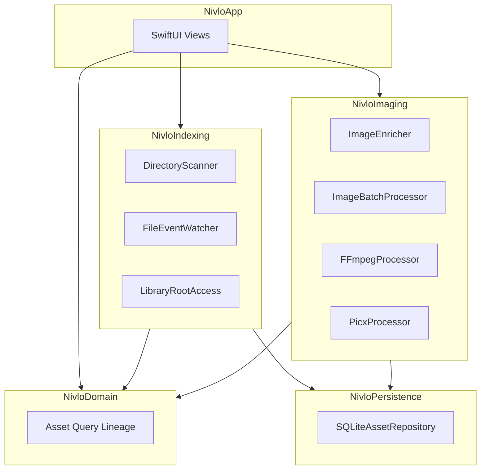

# Nivlo

[English](README.md) | [简体中文](README-CN.md)

**A local-first visual asset workbench for macOS.**

Nivlo helps you discover, index, browse, search, organize, process, edit, and trace images and videos across your folders, projects, downloads, and external drives — without moving originals or uploading them by default.

Repository: [github.com/ingeniousfrog/Nivlo](https://github.com/ingeniousfrog/Nivlo)

> Screenshots coming soon.

---

## Overview

Nivlo is built for people who keep visual assets scattered across Desktop, Downloads, project folders, and removable volumes. Instead of importing everything into a proprietary library, you explicitly authorize the folders you care about. Nivlo builds a rich local index on top of your existing file layout and keeps watching for changes.

Spotlight can surface lightweight discovery candidates, but the full index is built only after you grant folder access. All derived data — thumbnails, hashes, OCR text, and exports — lives under Application Support and never alters your source files.

---

## Highlights

- **Non-destructive by design** — Originals stay in place. Indexing, thumbnails, and exports are derivative data only.
- **Explicit authorization** — You choose which folders to index. No default scan of the entire system.
- **Stable file identity** — Assets are tracked by volume and file resource identifiers, so moved files can be reconciled across rescans.
- **Rich local metadata** — EXIF, Vision OCR, perceptual hashes, dominant colors, and FTS-backed full-text search.
- **Optional cloud AI** — Bring your own API key, stored in the macOS Keychain. No bundled model quota or default cloud analysis.

---

## Features

### Discover & Index

- Add library roots through explicit folder authorization with security-scoped bookmarks.
- Restore valid folder access across launches; isolate unavailable external volumes.
- Recursively scan authorized directories for images and videos, skipping hidden files and packages.
- Classify assets by likely source: Desktop, Downloads, Documents, external volumes, projects, and more.
- Surface up to 500 Spotlight metadata candidates before full indexing.
- Persist file and pixel metadata in a SQLite database with WAL mode.
- Enrich assets with thumbnails, SHA-256 hashes, 64-bit perceptual hashes, EXIF/TIFF metadata, Vision OCR, and dominant color buckets.
- Watch active library roots with FSEvents, coalesce bursts, and rescan only affected folders when possible.
- Invalidate and rebuild derived metadata when source files change; preserve records when access is temporarily lost.

### Browse & Search

- Browse indexed assets in a native SwiftUI grid with masonry layout support.
- Search by filename, path, OCR text, and keywords via SQLite FTS.
- Smart views for screenshots, recent downloads, recently modified images, and large files.
- Filter by time, folder, format, dimensions, file size, color, keywords, OCR text, and source.
- Sort by date, filename, size, dimensions, and folder.
- Built-in English and Chinese UI.

### Organize

- Group exact duplicates by SHA-256 content hash.
- Surface perceptually similar images using connected-component clustering.

### Batch Process & Export

- Write processed outputs to a chosen directory without modifying originals.
- Convert to PNG, JPEG, WebP, or AVIF (when supported by ImageIO on your Mac).
- Apply compression quality, resizing, and batch filename templates with overwrite-safe suffixes.
- Copy file paths or Markdown image references, reveal files in Finder, and drag file URLs from the grid.
- Track processing history and derivative lineage from source to export.

### Image Editor *(Phase 2 — Early Access)*

- Open indexed images in a lightweight editor canvas.
- Crop and rotate, apply adjustments, add annotations, and paint masks.
- Export optimized derivatives through Picx (WebP and related presets).

### Video Editor *(Phase 2 — Early Access)*

- Trim, transform, and export indexed videos through FFmpeg.
- Probe media with FFprobe; optionally export audio only.

### AI Generation *(Phase 2 — Early Access, optional)*

- Pluggable `GenerationAdapter` interface for text-to-image, image-to-image, inpainting, outpainting, background removal, super-resolution, and style variants.
- **Currently implemented:** OpenAI Images (`text-to-image`, `image-to-image`) with a user-provided API key.
- **Planned:** local model adapter (interface present, not yet configured).
- API keys are stored in the macOS Keychain, not in the repository or index database.

---

## Privacy & Local-First

Nivlo is designed around a few non-negotiable principles:

- **No proprietary library migration** — Your files stay where you put them.
- **No forced cloud sync, accounts, or multi-user collaboration.**
- **No default scan of all system directories** — Access is always explicit.
- **No bundled paid AI quota** — Cloud generation is opt-in with your own key.
- **Safe to delete derived data** — Removing `~/Library/Application Support/Nivlo/` clears the index, thumbnails, and tools cache without touching your original images or videos.

---

## Architecture

Nivlo is a Swift Package with a modular layout:



| Module | Role |
|--------|------|
| `NivloApp` | SwiftUI executable and application shell |
| `NivloDomain` | Domain models, queries, edit sessions, generation interfaces |
| `NivloIndexing` | Scanning, Spotlight candidates, FSEvents, bookmark authorization |
| `NivloImaging` | Enrichment, batch processing, similarity analysis, FFmpeg/Picx |
| `NivloPersistence` | SQLite repositories for assets, enrichment, and processing history |

---

## Getting Started

### Requirements

- macOS 14 or later
- Xcode 16 or later
- Swift 6

### Run from source

From the repository root:

```bash
swift run Nivlo
```

### First launch

1. **Authorize folders** — Choose the directories you want Nivlo to index.
2. **Wait for indexing** — Nivlo scans authorized roots, generates thumbnails, and enriches metadata in the background.
3. **Browse and work** — Search, filter, batch-export, or open assets in the image/video editors.

On first launch, Nivlo also bootstraps external tools (FFmpeg, FFprobe, and Picx) into Application Support. Video editing and Picx-based image export depend on this step completing successfully.

---

## Development

### Run tests

```bash
swift test
```

Tests use Swift Testing (`@Test`) across domain, indexing, imaging, and persistence modules.

### External tools

Managed by `ToolBootstrapper` and installed to:

```text
~/Library/Application Support/Nivlo/tools/
```

The manifest tracks FFmpeg, FFprobe, Picx, and a Python virtual environment. Check tool status in the library sidebar if video export or Picx optimization fails.

---

## Data & Storage

| Path | Contents |
|------|----------|
| `~/Library/Application Support/Nivlo/index.sqlite` | Main asset index and FTS tables |
| `~/Library/Application Support/Nivlo/Thumbnails/` | Local thumbnail cache |
| `~/Library/Application Support/Nivlo/tools/` | Bootstrapped FFmpeg, FFprobe, Picx, and support files |

All paths above are derivative. Deleting them does not remove or alter any original file on disk.

---

## Roadmap

### Phase 1 — Complete

Local visual asset workbench: authorized indexing, rich metadata, incremental maintenance, browse/search/filter, duplicate detection, batch processing, export history, and derivative lineage.

### Phase 2 — In Progress

- Lightweight image and video editing (early access in current builds).
- AI generation with pluggable adapters (OpenAI implemented; local model adapter planned).
- Deeper canvas editing, more export presets, and a fuller version-lineage UI.

### Phase 3 — Planned

- Semantic and image-to-image search.
- Automatic clustering and project asset association.
- Configurable local automation workflows.
- Optional cloud/provider integrations without default uploading.

---

## License

Copyright © [Ingenious Frog](https://github.com/ingeniousfrog)

Licensed under the [Apache License, Version 2.0](LICENSE).
