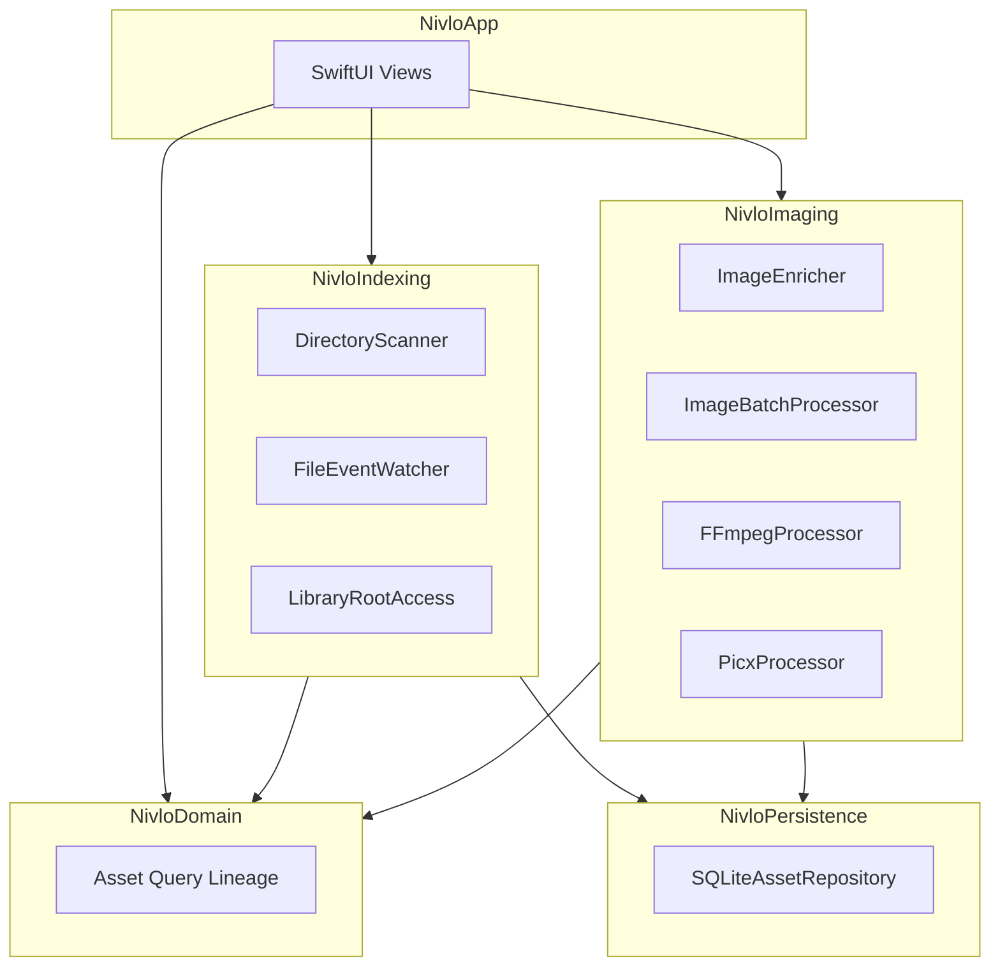

# Nivlo

[English](README.md) | [简体中文](README-CN.md)

**A local-first visual asset workbench for macOS.**

Nivlo helps you discover, index, browse, search, organize, rename, process, edit, and trace images and videos across your folders, projects, downloads, and external drives without moving originals or uploading them.

Repository: [github.com/ingeniousfrog/Nivlo](https://github.com/ingeniousfrog/Nivlo)

> Screenshots coming soon.
>
> Project status last verified against the repository on June 23, 2026.

---

## Overview

Nivlo is built for people who keep visual assets scattered across Desktop, Downloads, project folders, and removable volumes. Instead of importing everything into a proprietary library, you explicitly authorize the folders you care about. Nivlo builds a rich local index on top of your existing file layout and keeps watching for changes.

Spotlight can surface lightweight discovery candidates, but the full index is built only after you grant folder access. All derived data — thumbnails, hashes, OCR text, and exports — lives under Application Support and never alters your source files.

### How Nivlo differs from Apple Photos

Nivlo is not intended to replace the personal photo library and iCloud experience in Apple Photos. It is aimed at creators and developers who work with visual files that already live across project folders, Downloads, external drives, and other user-managed locations.

| Area | Nivlo | Apple Photos |
|------|-------|--------------|
| Storage model | Indexes authorized folders in place; originals keep their existing paths | Imports or references items through a managed Photos library |
| Primary workflow | Project assets, search, batch processing, derivative exports, and lineage | Personal memories, iPhone capture, albums, sharing, and cross-device sync |
| Cloud model | Local-only product surface; no accounts, sync service, or external credentials | Deep iCloud Photos and Apple ecosystem integration |
| Search and organization | Filename, path, OCR, metadata, color, source, exact duplicates, and perceptual similarity | People and pets, places, dates, media types, albums, Smart Albums, memories, and semantic search |
| Editing direction | File-oriented editing, export presets, annotations, masks, video trimming, and local delivery workflows | Mature photo adjustments, Live Photo/Portrait/Cinematic workflows, and extensions |
| Provenance | Explicit processing history and derivative lineage | Non-destructive edits inside the Photos library |

The strongest product position for Nivlo is therefore a **local visual asset workbench**, not a Photos clone: preserve folder ownership, make large mixed asset collections searchable, and connect renaming, conventional editing, and batch delivery in one traceable workflow.

---

## Highlights

- **Non-destructive by design** — Originals stay in place. Indexing, thumbnails, and exports are derivative data only.
- **Explicit authorization** — You choose which folders to index. No default scan of the entire system.
- **Stable file identity** — Assets are tracked by volume and file resource identifiers, so moved files can be reconciled across rescans.
- **Rich local metadata** — EXIF, Vision OCR, perceptual hashes, dominant colors, and FTS-backed full-text search.
- **No external credentials** — The app has no remote processing setup, account requirement, or external credential flow.

---

## Features

### Discover & Index

- Add library roots through explicit folder authorization with security-scoped bookmarks.
- Restore valid folder access across launches; isolate unavailable external volumes.
- Recursively scan authorized directories for images and videos, skipping hidden files and packages.
- Classify assets by likely source: Desktop, Downloads, Documents, external volumes, projects, and more.
- Surface up to 500 Spotlight metadata candidates before full indexing.
- Persist file and pixel metadata in a SQLite database with WAL mode.
- Enrich assets with thumbnails, SHA-256 hashes, 64-bit perceptual hashes, EXIF/TIFF metadata, Vision OCR, and dominant color buckets.
- Watch active library roots with FSEvents, coalesce bursts, and rescan only affected folders when possible.
- Invalidate and rebuild derived metadata when source files change; preserve records when access is temporarily lost.

### Browse & Search

- Browse indexed assets in a native SwiftUI grid with masonry layout support.
- Search by filename, path, OCR text, and keywords via SQLite FTS.
- Smart views for screenshots, recent downloads, recently modified images, and large files.
- Filter by time, folder, format, dimensions, file size, color, keywords, OCR text, and source.
- Sort by date, filename, size, dimensions, and folder.
- Built-in English and Chinese UI.

### Organize

- Group exact duplicates by SHA-256 content hash.
- Surface perceptually similar images using connected-component clustering.
- Rename original files in place with validation, conflict prevention, and processing-history records.

### Batch Process & Export

- Write processed outputs to a chosen directory without modifying originals.
- Convert to PNG, JPEG, WebP, or AVIF (when supported by ImageIO on your Mac).
- Apply compression quality, resizing, and batch filename templates with overwrite-safe suffixes.
- Copy file paths or Markdown image references, reveal files in Finder, and drag file URLs from the grid.
- Track processing history and derivative lineage from source to export.

### Image Editor *(Phase 2 — Beta)*

- Open indexed images in a native editor canvas.
- Crop, rotate, and flip; adjust exposure, contrast, saturation, and warmth.
- Add editable text, rectangle, and arrow annotations; paint and erase masks.
- Preview the composed result and export optimized derivatives through Picx.
- Track the exported edit in the asset lineage.

### Video Editor *(Phase 2 — Beta)*

- Preview, trim, crop, scale, rotate, and change frame rate.
- Export MP4, MOV, or WebM derivatives through FFmpeg.
- Probe media with FFprobe; optionally export audio only.

### Rename & Trace

- Rename the original asset from the preview toolbar or card context menu.
- Keep files in the same folder and preserve the current extension to avoid accidental format changes.
- Prevent collisions with existing files before touching disk.
- Refresh the local index after the rename and record the change in lineage.

---

## Privacy & Local-First

Nivlo is designed around a few non-negotiable principles:

- **No proprietary library migration** — Your files stay where you put them.
- **No forced cloud sync, accounts, or multi-user collaboration.**
- **No default scan of all system directories** — Access is always explicit.
- **No external processing credentials** — There is no remote processing setup or credential storage path.
- **Safe to delete derived data** — Removing `~/Library/Application Support/Nivlo/` clears the index, thumbnails, and tools cache without touching your original images or videos.

---

## Architecture

Nivlo is a Swift Package with a modular layout:



| Module | Role |
|--------|------|
| `NivloApp` | SwiftUI executable and application shell |
| `NivloDomain` | Domain models, queries, edit sessions, rename validation, and lineage |
| `NivloIndexing` | Scanning, Spotlight candidates, FSEvents, bookmark authorization |
| `NivloImaging` | Enrichment, batch processing, similarity analysis, FFmpeg/Picx |
| `NivloPersistence` | SQLite repositories for assets, enrichment, and processing history |

---

## Getting Started

### Requirements

- macOS 14 or later
- Xcode 16 or later
- Swift 6

### Download

Pre-built macOS builds are published on [GitHub Releases](https://github.com/ingeniousfrog/Nivlo/releases) as `Nivlo.dmg`.

1. Download the latest `.dmg` from Releases.
2. Open it and drag **Nivlo** into **Applications**.
3. On first launch, macOS may warn that the app is from an unidentified developer. You can either:
   - Right-click **Nivlo** in Applications and choose **Open**, then confirm once in the dialog.
   - Or remove the download quarantine flag in Terminal:

```bash
xattr -cr /Applications/Nivlo.app
```

The DMG is an unsigned early-access build and is not Apple code-signed or notarized. For development or the latest commit, use the source workflow below.

Installed builds store their library separately from `swift run Nivlo` development runs:

| Install type | Application Support path |
|--------------|-------------------------|
| DMG / `.app` release | `~/Library/Application Support/dev.nivlo/` |
| `swift run Nivlo` | `~/Library/Application Support/Nivlo/` |

If a release install shows folders you added while developing from source, you are likely still using the older shared path from a previous build. Remove the old folder or re-authorize folders inside the installed app.

### Run from source

From the repository root:

```bash
swift run Nivlo
```

### First launch

1. **Authorize folders** — Choose the directories you want Nivlo to index.
2. **Wait for indexing** — Nivlo scans authorized roots, generates thumbnails, and enriches metadata in the background.
3. **Browse and work** — Search, filter, batch-export, or open assets in the image/video editors.

On first launch, Nivlo also bootstraps external tools (FFmpeg, FFprobe, and Picx) into Application Support. Video editing and Picx-based image export depend on this step completing successfully.

---

## Development

### Run tests

```bash
swift test
```

Tests use Swift Testing (`@Test`) across domain, indexing, imaging, and persistence modules.

### Performance benchmarks

Run the synthetic 10k/50k/100k asset benchmark from the repository root:

```bash
swift run NivloBenchmark
```

The harness measures:

- SQLite-backed library startup after transactional fixture seeding.
- Masonry layout work used by scrolling.
- Bounded concurrent enrichment scheduling.
- A complete synthetic directory rescan.

Baseline captured on June 23, 2026:

| Assets | Startup | Layout | Enrichment | Rescan |
|-------:|--------:|-------:|-----------:|-------:|
| 10,000 | 12.15 ms | 1.88 ms | 44.83 ms | 431.40 ms |
| 50,000 | 63.89 ms | 11.96 ms | 232.24 ms | 2,085.12 ms |
| 100,000 | 117.02 ms | 21.45 ms | 469.97 ms | 4,203.56 ms |

Use these numbers as a local regression baseline, not as universal hardware targets.

### UI smoke workflow

For a real editor UI smoke workflow:

```bash
swift run Nivlo --ui-smoke
swift run Nivlo --ui-smoke --ui-smoke-video
```

Smoke mode creates real local PNG and H.264 MOV fixtures, then opens the image or video editor without touching the user's asset library.

### Package a local DMG

To build a release `.app` bundle and `.dmg` locally:

```bash
VERSION=0.1.0 Scripts/package-dmg.sh
```

Artifacts are written to `dist/Nivlo.app` and `dist/Nivlo.dmg`. Pushing a `v*` git tag triggers the same packaging workflow on GitHub Actions and uploads the DMG to Releases.

### External tools

Managed by `ToolBootstrapper` and installed to:

```text
~/Library/Application Support/Nivlo/tools/
```

The manifest tracks FFmpeg, FFprobe, Picx, and a Python virtual environment. Check tool status in the library sidebar if video export or Picx optimization fails.

---

## Data & Storage

| Path | Contents |
|------|----------|
| `~/Library/Application Support/dev.nivlo/index.sqlite` | Release app index (DMG install) |
| `~/Library/Application Support/Nivlo/index.sqlite` | Development index (`swift run`) |
| `~/Library/Application Support/*/Thumbnails/` | Local thumbnail cache for that install |
| `~/Library/Application Support/*/tools/` | Bootstrapped FFmpeg, FFprobe, Picx, and support files |

All paths above are derivative. Deleting them does not remove or alter any original file on disk.

---

## Roadmap

The phases below describe user-visible outcomes, not just the presence of interfaces or UI shells.

### Phase 0 — Foundation *(complete)*

Native SwiftUI application shell, modular Swift Package structure, SQLite persistence, security-scoped folder access, and automated domain/indexing/imaging/persistence tests.

### Phase 1 — Local asset library *(core complete)*

Local visual asset workbench: authorized indexing, rich metadata, incremental maintenance, browse/search/filter, duplicate detection, batch processing, export history, and derivative lineage.

Remaining work is primarily hardening: large-library performance, clearer index/tool health, recovery flows, and real-world usability validation.

### Phase 2 — Native editing workbench *(beta, in progress)*

Already available:

- Non-destructive image geometry, basic global adjustments, annotations, masks, preview, and export.
- Video preview, trim, transform, export, and audio extraction.
- Processing history and a basic lineage view.

Next editing milestone:

- RGB and luminance histograms with interactive black point, white point, and gamma controls.
- Levels and curves, plus HSL/HSV color-range editing rather than only whole-image saturation.
- White balance/tint, highlights/shadows, clarity/definition, sharpen, noise reduction, vignette, and reusable presets.
- Undo/redo history, before/after comparison, zoom/pan, and saved edit sessions.
- Better layer controls and mask-assisted local adjustments.

### Phase 3 — Local organization workbench *(next)*

- Batch rename with preview, numbering, token templates, conflict review, and undo.
- Saved searches and smart collections for repeated project workflows.
- Stronger duplicate/similar review with side-by-side comparison, keep/hide decisions, and folder-aware cleanup.
- Metadata editing for local tags, ratings, notes, and project labels stored in Nivlo's index.
- More robust file operations: move/copy to project folders, reveal all derivatives, and repair missing paths.

### Phase 4 — Local automation and delivery *(later)*

- Reusable local workflows for resize, convert, watermark, rename, and export presets.
- Watch-folder rules that turn incoming screenshots, downloads, and project assets into organized outputs.
- Better history controls: undo where possible, snapshots of batch operations, and clearer failure recovery.
- Optional on-device analysis where it can run locally and keep source files on the Mac.
- Packaging polish: signed/notarized builds, updater flow, and first-run sample library.

---

## License

Copyright © [Ingenious Frog](https://github.com/ingeniousfrog)

Licensed under the [Apache License, Version 2.0](LICENSE).
